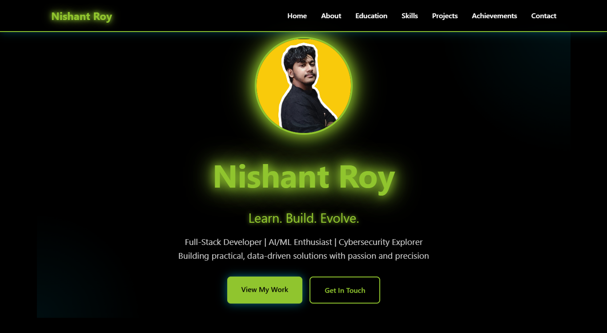
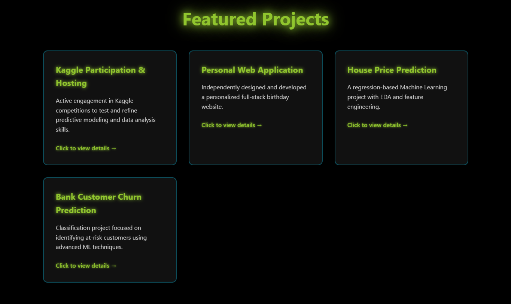
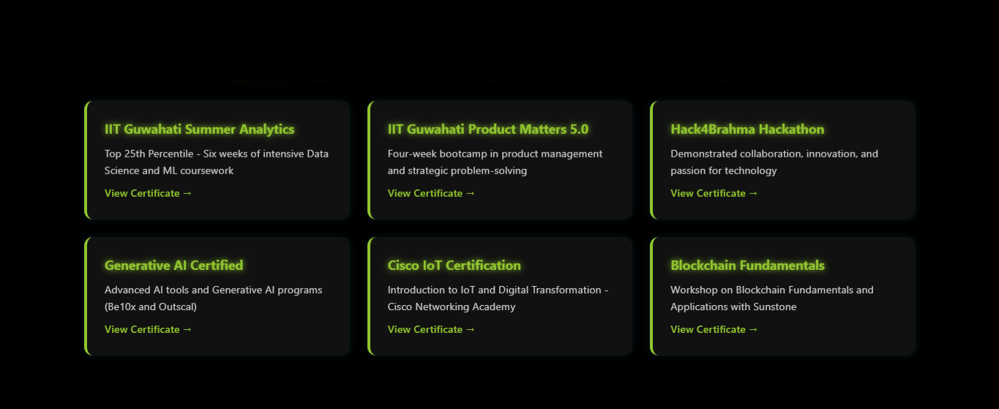
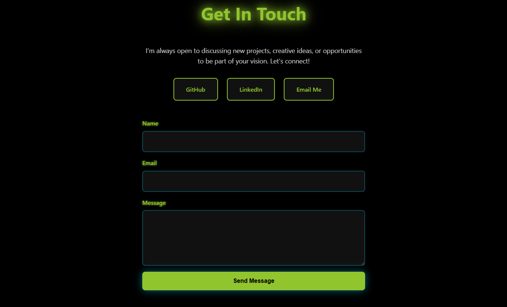

# Nishant Roy - Developer Portfolio

## Project Summary and Features
This portfolio website showcases my skills, projects, education, and certifications as a Full-Stack Developer and AI/ML enthusiast.  
**Key Features:**
- Responsive design for desktop, tablet, and mobile
- Smooth scrolling and CSS/JS animations
- Interactive projects and certifications sections with hover effects
- Contact form for visitors to reach out
- Modern cyberpunk/neon aesthetic

## Tools Used
- HTML5
- CSS3 (Flexbox, Grid, Media Queries, Animations)
- JavaScript (ES6+, DOM Manipulation, Event Listeners)
- Cursor AI (for scaffolding and refactoring)
- GitHub Pages (for live deployment)

## 📦 Project Structure
'''
portfolio/
├── index.html # Main HTML file with all content
├── style.css # Complete styling and animations
├── script.js # JavaScript functionality
├── README.md # Project documentation
└── screenshots/
├── hero-section.png
├── projects-section.png
├── certifications-section.png
└── contact-section.png
'''

## Screenshots

### Hero Section

### Projects Section

### Certifications Section

### Contact Section

## Live Link
[View Live Portfolio](https://nishantroy449.github.io/nishant-portfolio/)

## Repository Link
[GitHub Repository](https://github.com/nishantroy449/nishant-portfolio)
